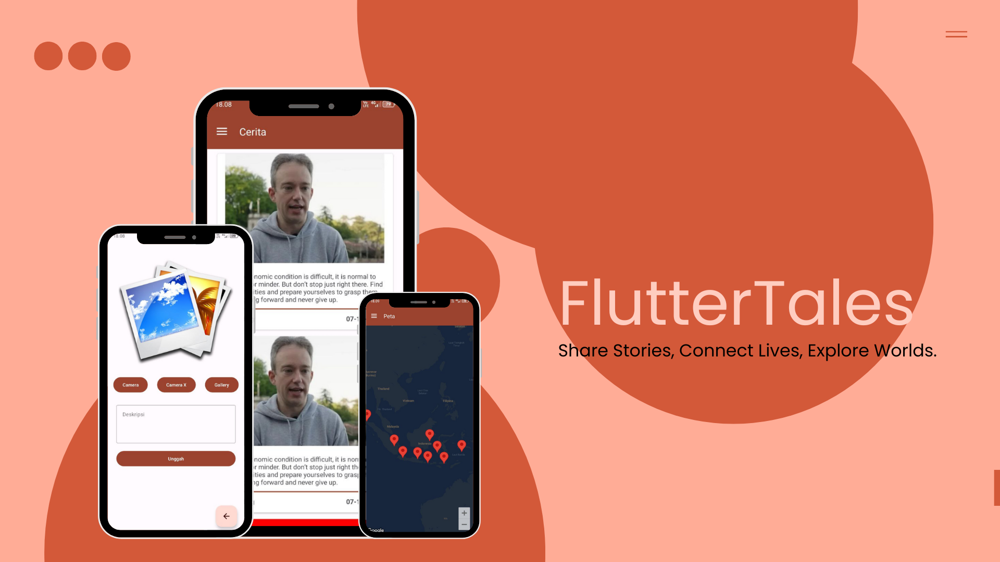

# FlutterTales

FlutterTales is an Android mobile application that allows users to share stories, connect with others, and explore diverse experiences. It offers seamless authentication, location-based story sharing, and the ability to save favorite stories for later reading.

## About the App

FlutterTales is designed to provide a platform for users to share their personal stories with others. The app supports features like authentication with email and password, displaying a list of user stories using Paging3 for efficient loading, and tracking story locations via Google Maps API. Users can also save their favorite stories locally using Room database for offline access.

## Tech Stack

- **Kotlin**: Primary language for Android development.
- **Android Studio**: The IDE used for app development.
- **Firebase Authentication**: Secure user authentication via email and password.
- **Paging3**: For efficient pagination of user stories.
- **Room**: Local database for storing favorite stories.
- **Google Maps API**: For location tracking and visualizing the locations of user stories.

## Features

- **Authentication**: Secure sign-in with email and password using Firebase Authentication.
- **Story List**: Display a list of stories shared by other users, efficiently loaded using Paging3.
- **Post a Story**: Users can create and post their own stories, with an option to include their current location or share a story without location data.
- **Location Tracker**: Integrates with Google Maps API to track the geographical locations where user stories are shared and display them on the map.
- **Story Favorites**: Users can mark stories as favorites, which are then saved locally using Room database for offline access.

## API Management

All data related to the stories is managed by the following API:
[Story API](https://story-api.dicoding.dev/v1#/)

This API handles user authentication, story submissions, and data retrieval. It ensures that all the stories and user interactions are securely managed.